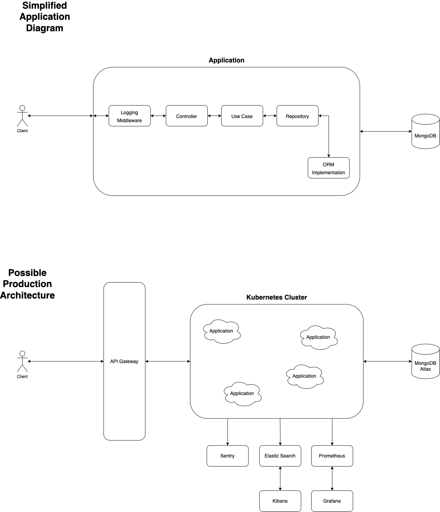

# Running Application

- Add the `.env` file to the root of the application. Make sure it matches the secrets specified in the `.env.example` file.
- Have node and npm installed (lts is recommended), and run `npm install` to install the required dependencies.
- Run the application locally using `npm run dev`
- The server defaults to running on port `8081`

## Running with docker

It is also possible to run the application inside a container. Just run `docker-compose up -d` to run the container in detached mode.

# Decisions

This application was built using three main tools: Nestjs, Prisma, and MongoDB. Here is the rationale behind these choices.

## NestJS

NestJS is a powerful node framework for building backend applications, different from express it is much more opinionated on how you should structure your application. As I wanted to develop something well structured and was time constrained (due to my own responsibilities), NestJS provided me with a better experience, as it would not require me to define the structure from the ground up, as it would already give me some headstart. It allowed me to use dependency injection, cron jobs, and other minor features, that would other require time to set up, all without much burden.

## Prisma

Prisma is an ORM for communicating with databases that provide a very developer friendly and strongly typed API. It allowed me to generate types based on my database schema, which I later used around the application to enhance my types and reduce bug risk. It is important to note that I chose to do this knowing that this is not ideal, as if we were to change the ORM this would generate a lot of work. In a less time-constrained scenario, I would create similar types as the ones created by Prisma, and not use the ones it creates. But as it was not the case I decided to use what was available, while aware of the possible downside.

## MongoDB

MongoDB is a great NoSQL database that has most of the features any application will ever need. I chose to use MongoDB Atlas, their hosted service, as it provides auto-scaling, multi-region availability, and auto backups. This paired with it being supported by Prisma, allows me to have a well-defined schema for my data, making it a no-brainer choice.

## Code Decisions

### Code Architecture

I chose to go for a more minimal architecture, as I wanted to reduce the overhead for someone new to pick up the project and understand where things are and where they should go. My focus was not on delivering the most efficient and scalable code architecture but on doing something that a new developer would be able to make sense of and work with.

### ORM Interface

I have chosen to create an interface for the ORM as I understand that as applications evolve the need to use a different database paradigm or to have different types of data stored in different types of databases grow. So I tried to make it so that the process of migrating or adding a new database or ORM would be simpler. I understand that it is not the most generic as is, as I mentioned in the Prisma section. This would be one of the features I would improve in the future.

### Logging

I made a logging middleware that allows us to see everything that is coming into the application and what is going out. It also includes a tracking id so that we can map one to the other. This is a very minimal implementation of what it could be, as it is missing the persistence of the logs, and the errors thrown inside of the application don't have the tracking id, so they are not easily matched to a specific request that caused them. A possible evolution would be to persist these logs in something like Elastic Search, so they could be better searched and used more effectively. The errors could also be forwarded to something like Sentry, so they could be acted upon.

### Error handling

The approach taken is similar to what is used in Rust and Go, which allowed the decisions of what to make out of the exceptions to be made by the controller.

# Next Steps

Even though this project works it is far from finished. There are many improvements that can be made. Some of them would be monitoring the application by using something like Prometheus and Grafana, logging and error handling (as previously mentioned), and much more. Treat this application more like an MVP than a finished project. Many trade-offs had to be made, and I am aware of the benefits and the downside of them and would love to chat more about why I chose what I chose.

# Application Diagram

